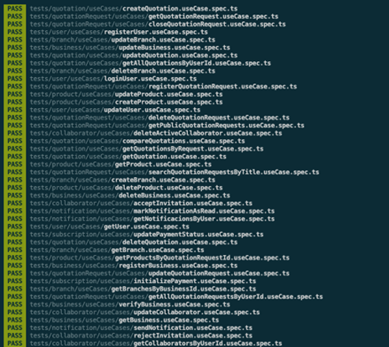
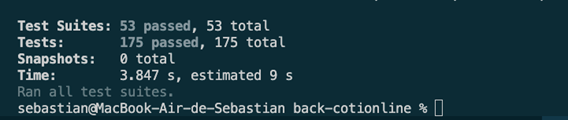
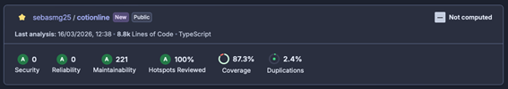
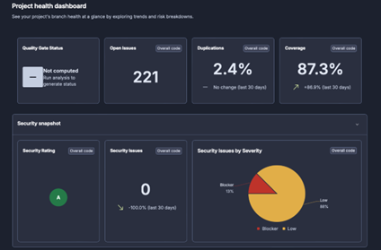
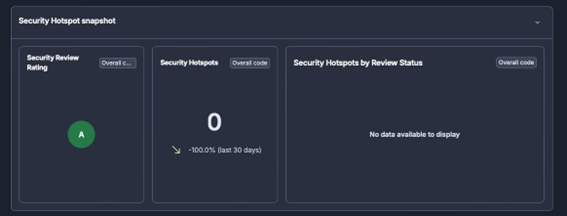
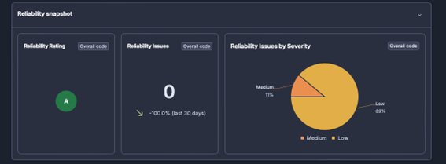

# Análisis de código y pruebas unitarias

## INFORME DE ASEGURAMIENTO DE LA CALIDAD Y PRUEBAS

### 1. Estrategia de Calidad

Para garantizar la estabilidad, seguridad y escalabilidad de la plataforma CotiOnline, se implementó una estrategia integral de calidad basada en dos pilares fundamentales:
Pruebas Unitarias Automáticas: Utilizando el framework Jest para validar la lógica de los casos de uso.
Análisis Estático de Código: Utilizando SonarQube / SonarCloud para medir la deuda técnica, seguridad y mantenibilidad.

### 2. Pruebas Unitarias (Framework Jest)

Se desarrollaron pruebas exhaustivas para los componentes críticos del sistema (Contextos de Usuario, Negocio, Cotizaciones, Notificaciones y Suscripciones). El motor de pruebas valida el comportamiento esperado de cada "Caso de uso" de manera aislada.
2.1. Resumen de Ejecución
En la última ejecución se obtuvo un 100% de éxito en todas las suites de pruebas definidas, garantizando que los cambios recientes no afectaron funcionalidades existentes (regresión).

### 3. Cobertura de Código (Code Coverage)

La cobertura mide qué porcentaje de las líneas de código han sido efectivamente ejecutadas por las pruebas unitarias. Se alcanzó un 87.13% de cobertura general, superando con éxito el umbral estándar de la industria (80%).

### 4. Análisis de Calidad SonarQube

El proyecto fue sometido a un análisis riguroso en SonarQube, obteniendo las calificaciones más altas posibles en los indicadores clave de salud de software.

4.1. Dashboard General de Calidad
El sistema obtuvo una calificación Triple A (AAA), lo que representa un software con altos estándares de seguridad y fiabilidad.

4.2. Desglose de Indicadores

- Fiabilidad (Reliability): Calificación A. Se detectaron 0 bugs en el código analizado.
- Seguridad: Calificación A. El sistema cuenta con 0 vulnerabilidades y 0 Hotspots de seguridad abiertos, garantizando el manejo seguro de los datos.
- Mantenibilidad: Calificación A. Se mantiene una deuda técnica mínima, facilitando que nuevos desarrolladores puedan escalar el sistema sin dificultades.
- Duplicidad: Solo un 2.4% de código duplicado, lo que demuestra un desarrollo limpio y optimizado.

### 5. Conclusión

Los resultados obtenidos demuestran un compromiso con la excelencia técnica. Con un 87.3% de cobertura y una calificación de A en Seguridad, Fiabilidad y Mantenibilidad, la plataforma CotiOnline se encuentra en un estado óptimo para su despliegue en producción y su futura evolución tecnológica.
